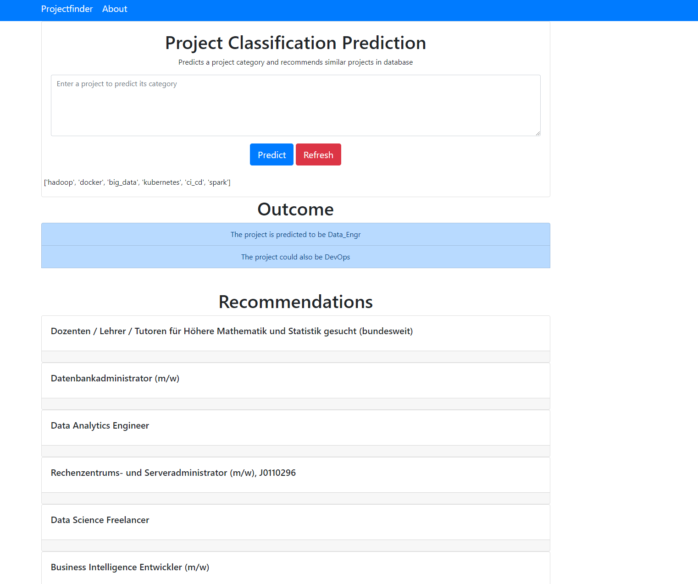

# Document Classifier & Recommeneder System  []

> A web app that classifies IT projects and recommends similar projects

## Table of contents

- [Screenshots](#screenshots)
- [Technologies](#technologies)
- [Setup](#setup)
- [Docker](#docker)

## Screenshots

- Homepage

## Technologies

- Flask
- Pandas
- Sci-Kit Learn
- Gensim
- Docker
- Docker-Compose
- GitLab

## Setup

To get the app running locally:

- Clone this repo
- cd into the cloned repo
- `create and activate a virtual enviroment then pip install -r requirements.txt` to install all required dependencies 
- `python main.py` to start start local server

Local web server will use port 3001

## Docker

To setup using Docker:

- Download [Docker](https://docs.docker.com/) if you dont have it
- Make sure Docker is running
- Clone this repo
- cd into the project
- run `docker-compose up` in your terminal to setup, build and run image. This may take some time to complete
- When complete go to your localhost on port 3001

