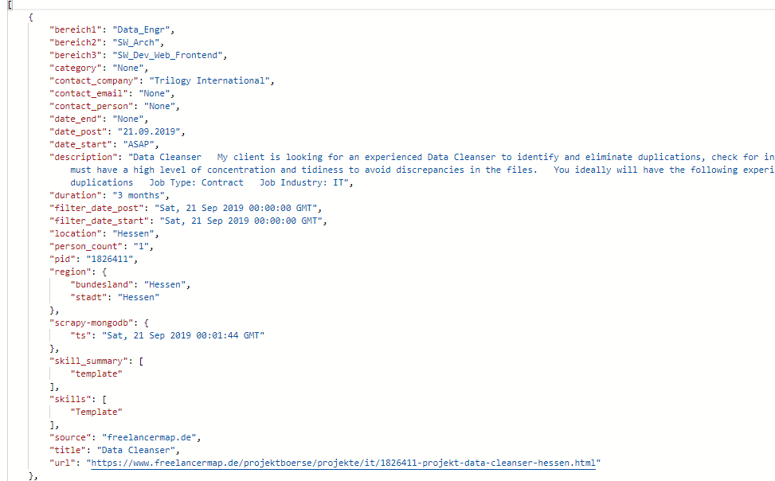

# Document Classifier & Recommeneder System  

> A web app that takes an IT based project description and predicts its category (e.g: Web dev, Data Engr, Devops, etc) and recommends similar projects to the user using a previously trained Machine Learning model  
> The Machine Learning model was trained using the projectfinder data and the code and approach involved can be found [here](https://gitlab.actgruppe.de/data-science-projects/projectfinder_analytics)

## Table of contents

- [Screenshots](#screenshots)
- [Technologies](#technologies)
- [Setup](#setup)
- [Docker](#docker)
- [API](#api)

## Screenshots

- Homepage

## Technologies

- Flask
- Pandas
- Sci-Kit Learn
- Gensim
- Docker
- Docker-Compose
- GitLab

## Setup

To get the app running locally:

- Clone this repo
- cd into the cloned repo
- `create and activate a virtual enviroment then pip install -r requirements.txt` to install all required dependencies 
- `python main.py` to start start local server

Local web server will use port 3001

## Docker

To setup using Docker:

- Download [Docker](https://docs.docker.com/) if you dont have it
- Make sure Docker is running
- Clone this repo
- cd into the project
- run `docker-compose up` in your terminal to setup, build and run image. This may take some time to complete
- When complete go to your localhost on port 3001

## API

To use the API:

- The API route is `/api`
- Make sure app server is running
- Send a POST request in JSON format. Example: `{ "skills": "python, hadoop, spark, big data, docker" }`
- 

